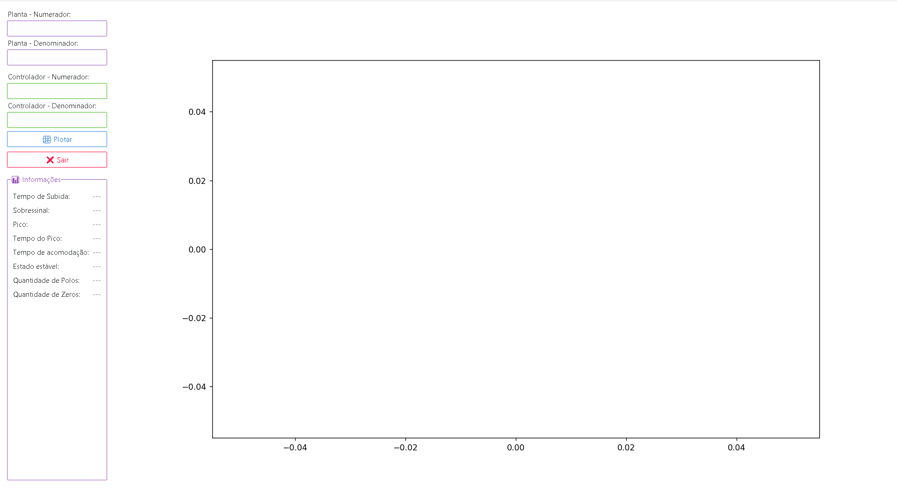
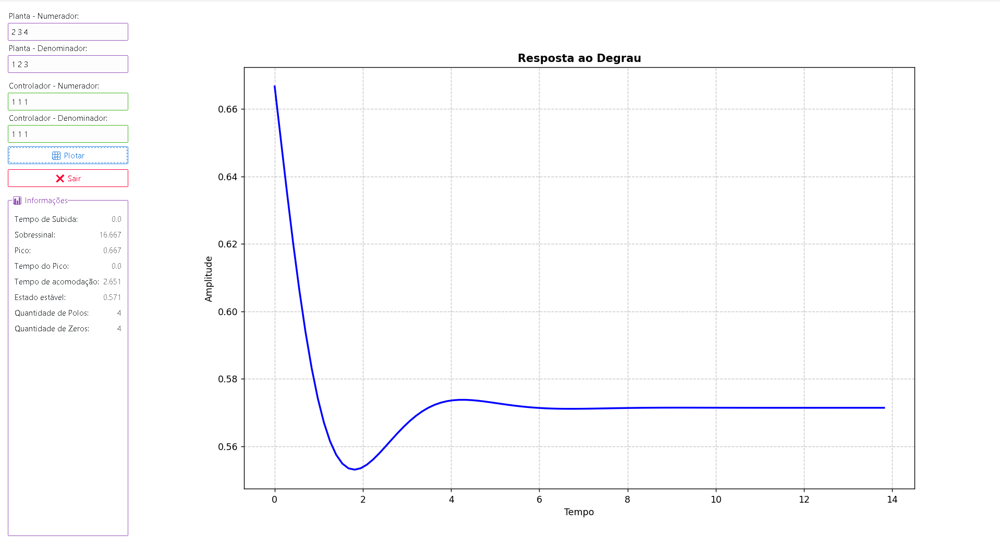

# Control System Analyzer

A graphical tool to analyze control systems, built with **Python, PySimpleGUI, Matplotlib, and Control library**.  
It allows users to input transfer functions (plant + PID controller), visualize the step response, and check key system metrics.

---

## 📺 Demo (Output)

Interface example with system input and step response graph:

  
  

---

## 📋 Features

- Input numerator and denominator for **plant** and **controller**  
- Compute open-loop and closed-loop transfer functions  
- Real-time **step response plot**  
- Display performance metrics:
  - Rise time
  - Overshoot
  - Peak value
  - Peak time
  - Settling time
  - Steady-state value
  - Number of poles and zeros  

---

## 🛠 Tech Stack

- **Python 3.9+**
- [PySimpleGUI](https://pysimplegui.readthedocs.io/en/latest/) — GUI  
- [Matplotlib](https://matplotlib.org/) — plotting  
- [Control](https://python-control.readthedocs.io/en/latest/) — system analysis  
- [NumPy](https://numpy.org/) — numeric support  

---

## 🚀 How to Run

1. Clone this repository:
   ```bash
   git clone https://github.com/your-username/control-system-analyzer.git
   cd control-system-analyzer
    ```
2. Create a virtual enviroment:
    ```bash
    python -m venv .venv
    #   Activate it
    .venv\Scripts\activate      # Windows
    source .venv/bin/activate   # Linux/Mac

3. Install dependencies:
    ```bash
    pip install -r requirements.txt
    ```
4. Run the project
    ```bash
    python analisys.py
    ```

## 📦 Requirements

Install them with:
    ```bash
    pip install -r requirements.txt
    ```

## 🔮 Possible Improvements
 - Export step response graphs automatically (PNG/PDF)
 - Add support for Bode plots, Root Locus, and Nyquist diagrams
 - Save/load multiple system configurations
 - Export performance metrics as CSV or PDF reports
 - Build a web version (e.g., with Flask or Django + React)

## ℹ️ Author

**Gabriel Pawlowski** — Backend Developer

🔗 [LinkedIn Profile](https://www.linkedin.com/in/ggpawlowski/)  